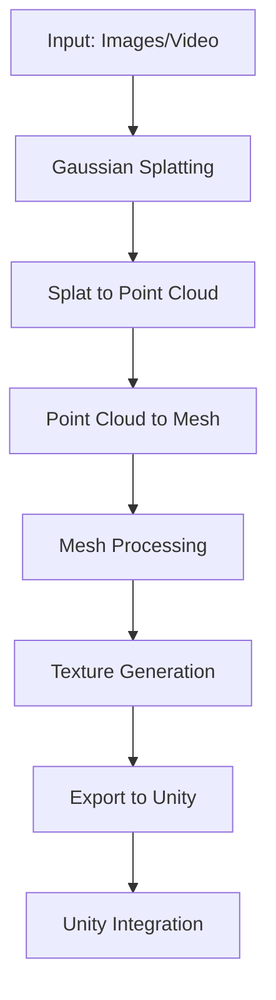
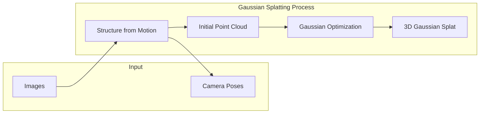
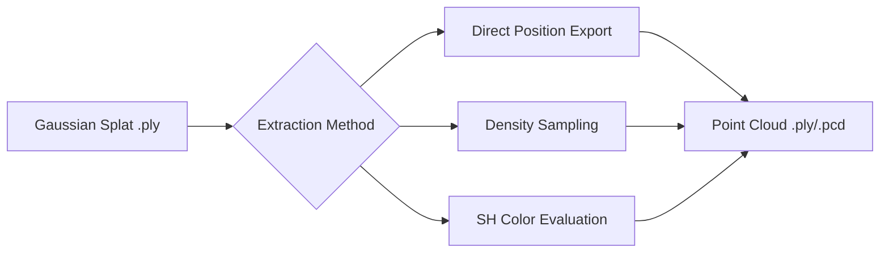
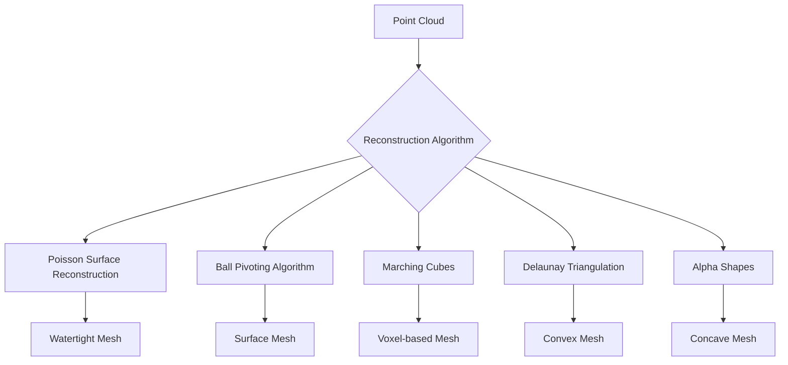
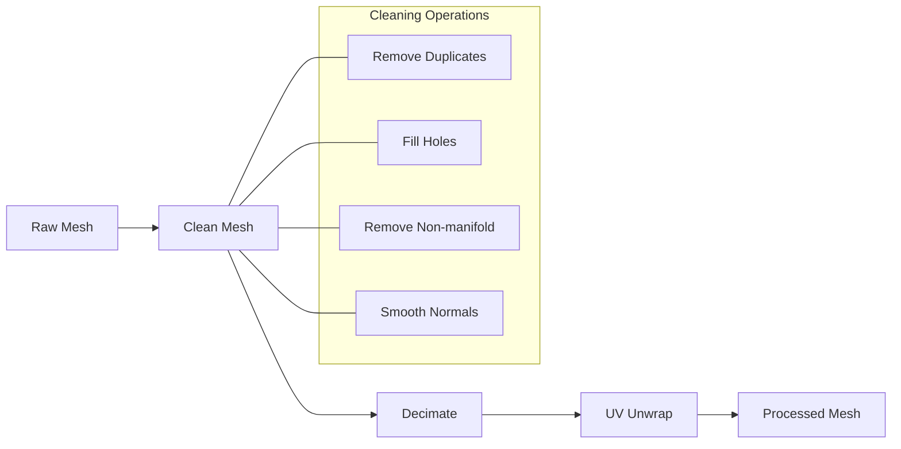
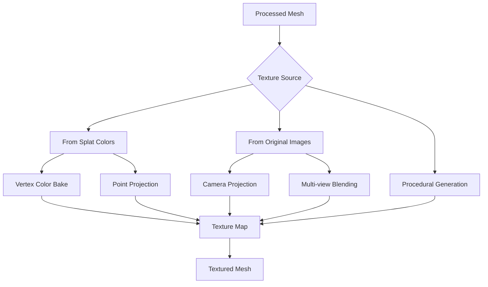
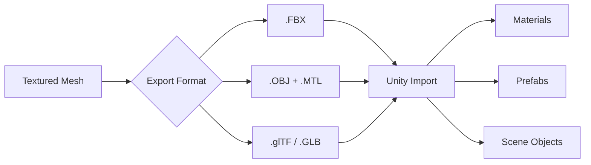
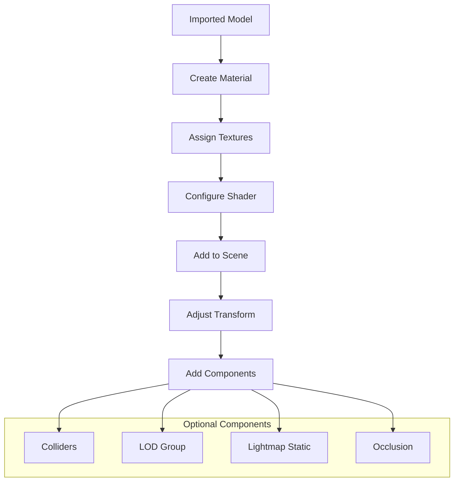
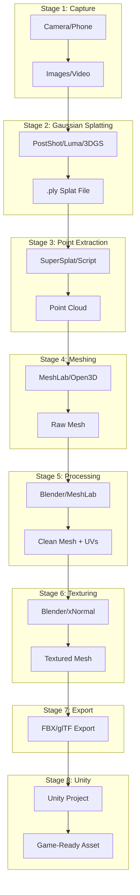
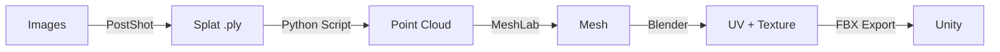

# Gaussian Splat to 3D Model Pipeline for Unity

This document outlines a basic pipeline for converting Gaussian Splats into usable 3D models within Unity 3D.

## Pipeline Overview



---

## Stage 1: Input Capture

### Description
Capture images or video of the target object/scene for reconstruction.

### Requirements
- Multiple overlapping images (50-200+ images recommended)
- Good lighting, minimal motion blur
- Full coverage of the subject

### Tool Options

| Tool | Type | Notes |
|------|------|-------|
| Smartphone Camera | Hardware | Accessible, decent quality |
| DSLR/Mirrorless | Hardware | Higher quality, more control |
| Video Capture | Hardware | Extract frames, easier capture |
| Drone | Hardware | For large scenes/environments |

---

## Stage 2: Gaussian Splatting



### Description
Convert input images into a 3D Gaussian Splat representation.

### Tool Options

| Tool | Type | Cost | Pros | Cons |
|------|------|------|------|------|
| **PostShot (Jawset)** | Commercial | Paid | User-friendly, good quality, you already have it | Windows only, closed source |
| **Luma AI** | Cloud Service | Free tier / Paid | Very easy, no local GPU needed | Cloud-based, limited control |
| **Polycam** | Mobile/Cloud | Free tier / Paid | Mobile capture + processing | Less control over output |
| **3DGS (Original)** | Open Source | Free | Reference implementation | Requires CUDA, technical setup |
| **gsplat** | Open Source | Free | Python library, flexible | Requires coding knowledge |
| **Nerfstudio** | Open Source | Free | Multiple methods, well documented | Complex setup |
| **COLMAP + 3DGS** | Open Source | Free | Full control | Most technical, multi-step |

### Output Format
- `.ply` file (most common)
- `.splat` file (web format)
- Proprietary formats (tool-dependent)

### Self-Build Potential: **Medium-High**
Could implement using gsplat or the original 3DGS codebase, but requires significant ML/graphics knowledge and GPU resources.

---

## Stage 3: Splat to Point Cloud



### Description
Extract point cloud data from the Gaussian Splat. Each Gaussian has a position (x, y, z) and color information stored as Spherical Harmonics.

### Tool Options

| Tool | Type | Cost | Notes |
|------|------|------|-------|
| **SuperSplat** | Web Tool | Free | Browser-based, can export points |
| **CloudCompare** | Desktop | Free | Can load PLY, extract points |
| **Custom Python Script** | Self-made | Free | Full control, use plyfile library |
| **Blender + Add-on** | Desktop | Free | Various splat importers available |
| **Open3D** | Python Library | Free | Programmatic point cloud handling |

### Self-Build Potential: **High**
This is straightforward to implement yourself:

```python
# Pseudocode for extracting points from gaussian splat
import numpy as np
from plyfile import PlyData

def splat_to_pointcloud(splat_path, output_path):
    plydata = PlyData.read(splat_path)
    vertex = plydata['vertex']
    
    # Extract positions
    x = vertex['x']
    y = vertex['y']
    z = vertex['z']
    
    # Extract colors (from SH coefficients or direct RGB)
    # DC component of SH gives base color
    r = vertex['f_dc_0']  # May need sigmoid activation
    g = vertex['f_dc_1']
    b = vertex['f_dc_2']
    
    # Save as colored point cloud
    # ...
```

---

## Stage 4: Point Cloud to Mesh



### Description
Convert the point cloud into a triangle mesh. This is often the most challenging step.

### Algorithm Comparison

| Algorithm | Best For | Watertight | Speed | Quality |
|-----------|----------|------------|-------|---------|
| **Poisson** | Dense clouds with normals | Yes | Medium | High |
| **Ball Pivoting** | Uniform density clouds | No | Fast | Medium |
| **Marching Cubes** | Volumetric/dense data | Yes | Fast | Medium |
| **Alpha Shapes** | Concave objects | No | Fast | Variable |
| **Screened Poisson** | Noisy data | Yes | Medium | High |

### Tool Options

| Tool | Type | Cost | Algorithms Available |
|------|------|------|---------------------|
| **MeshLab** | Desktop | Free | Poisson, Ball Pivoting, Marching Cubes, VCG |
| **CloudCompare** | Desktop | Free | Poisson, Delaunay, Ball Pivoting |
| **Open3D** | Python | Free | Poisson, Ball Pivoting, Alpha Shapes |
| **Blender** | Desktop | Free | Limited built-in, add-ons available |
| **MeshRoom** | Desktop | Free | Integrated photogrammetry pipeline |
| **Reality Capture** | Commercial | Paid | High quality, automated |
| **CGAL** | C++ Library | Free | Many algorithms, research-grade |

### Self-Build Potential: **Medium**
Can use Open3D or CGAL libraries to implement, but algorithms are complex. Recommended to use existing tools.

```python
# Example using Open3D
import open3d as o3d

pcd = o3d.io.read_point_cloud("pointcloud.ply")
pcd.estimate_normals()

# Poisson reconstruction
mesh, densities = o3d.geometry.TriangleMesh.create_from_point_cloud_poisson(
    pcd, depth=9
)
```

---

## Stage 5: Mesh Processing



### Description
Clean and optimize the mesh for use in Unity (game engine requirements).

### Operations Needed

1. **Cleaning**: Remove degenerate triangles, duplicate vertices, non-manifold geometry
2. **Decimation**: Reduce polygon count for performance
3. **UV Unwrapping**: Create texture coordinates
4. **Normal Calculation**: Ensure proper lighting

### Tool Options

| Tool | Type | Cost | Best For |
|------|------|------|----------|
| **Blender** | Desktop | Free | Full control, scripting, UV unwrapping |
| **MeshLab** | Desktop | Free | Cleaning, decimation, batch processing |
| **Instant Meshes** | Desktop | Free | Retopology, quad meshes |
| **Simplygon** | Commercial | Paid | LOD generation, optimization |
| **Unity ProBuilder** | Unity Plugin | Free | In-engine editing |

### Self-Build Potential: **Medium**
Basic operations can be scripted in Python/Blender. Complex operations (UV unwrapping) are better left to existing tools.

---

## Stage 6: Texture Generation



### Description
Generate textures for the mesh from available color data.

### Methods

| Method | Quality | Complexity | Requirements |
|--------|---------|------------|--------------|
| **Vertex Color Baking** | Low-Medium | Simple | UV coords, splat colors |
| **Point-to-Surface Projection** | Medium | Medium | Point colors, UV coords |
| **Image Re-projection** | High | Complex | Original images + camera poses |
| **Neural Texture** | High | Very Complex | ML pipeline |

### Tool Options

| Tool | Type | Cost | Notes |
|------|------|------|-------|
| **Blender** | Desktop | Free | Baking, projection painting |
| **xNormal** | Desktop | Free | Texture baking specialist |
| **Substance Painter** | Commercial | Paid | Professional texturing |
| **Meshroom** | Desktop | Free | Integrated texturing from photos |
| **Custom Script** | Self-made | Free | Vertex color to texture |

### Self-Build Potential: **Medium-High**
Vertex color baking is straightforward. Image re-projection requires camera pose data and is more complex.

---

## Stage 7: Export to Unity



### Recommended Formats for Unity

| Format | Textures | Animation | Recommended |
|--------|----------|-----------|-------------|
| **.FBX** | Embedded/External | Yes | Yes - Most compatible |
| **.OBJ** | External (.mtl) | No | Yes - Simple static meshes |
| **.glTF/.GLB** | Embedded | Yes | Yes - Modern, efficient |
| **.DAE** | External | Yes | Okay - Older format |

### Export Checklist

- [ ] Correct scale (Unity uses meters)
- [ ] Proper axis orientation (Unity: Y-up, left-handed)
- [ ] UV coordinates present
- [ ] Textures in compatible format (PNG, JPG, TGA)
- [ ] Reasonable polygon count
- [ ] Clean topology

---

## Stage 8: Unity Integration



### Unity Setup

1. **Import Settings**: Configure mesh import settings in Unity
2. **Material Creation**: Create materials using Standard or URP/HDRP shaders
3. **Prefab Creation**: Create reusable prefabs
4. **Scene Integration**: Place in scene with proper transforms

### Self-Build Potential: **High**
This is standard Unity workflow, fully customizable with C# scripts.

---

## Complete Pipeline Diagram



---

## Recommended Basic Pipeline (Minimal Tools)

For a straightforward first implementation:



### Tool Stack

1. **PostShot (Jawset)** - Gaussian Splatting (you have this)
2. **Python + plyfile/Open3D** - Point extraction (self-made)
3. **MeshLab** - Point cloud to mesh (free)
4. **Blender** - Mesh processing + texturing (free)
5. **Unity** - Final integration

---

## Implementation Priority

| Priority | Stage | Effort | Tools |
|----------|-------|--------|-------|
| 1 | Gaussian Splatting | Low | PostShot (already owned) |
| 2 | Point Extraction | Low | Python script (self-made) |
| 3 | Point to Mesh | Medium | MeshLab (free) |
| 4 | Mesh Processing | Medium | Blender (free) |
| 5 | Basic Texturing | Medium | Blender (free) |
| 6 | Unity Import | Low | Unity (standard workflow) |

---

## Next Steps

1. [ ] Test PostShot with sample images to generate first splat
2. [ ] Write Python script to extract point cloud from splat PLY
3. [ ] Test Poisson reconstruction in MeshLab
4. [ ] Set up Blender pipeline for mesh processing
5. [ ] Create Unity import workflow
6. [ ] Document any issues and iterate

---

## Future Improvements (Out of Scope for Basic Pipeline)

- Mesh smoothing and noise reduction
- Advanced texture baking with multi-view blending
- LOD generation for performance
- Automation scripts for batch processing
- Real-time splat rendering in Unity (alternative to mesh conversion)
- Neural surface extraction (NeUS, NeuralAngelo)
